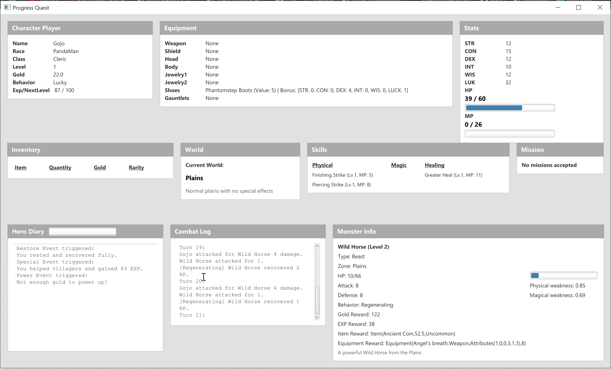

# Progress Quest

## Panoramica del Progetto

**Progress Quest** è una replica in Scala del classico gioco Progress Quest, sviluppata nell’ambito del corso PARADIGMI DI PROGRAMMAZIONE E SVILUPPO presso l'Università di Bologna (sede di Cesena).

Il progetto appartiene al genere dei zero-player game (ZPG), in cui il personaggio progredisce automaticamente senza intervento diretto da parte del giocatore. A differenza dell’originale, questa versione introduce un’inedita forma di interazione ispirata a Godville, uno dei pionieri del genere ZPG. In occasione di eventi speciali, al giocatore viene data l’opportunità di influenzare l’andamento del gioco, pur mantenendo la struttura automatizzata di base.

---

## Gameplay

---

---

## Instruzioni di run
Per eseguire il progetto, assicurati di aver installato Java JDK 21 e di aver scaricato JavaFX SDK versione 21.0.* dal sito ufficiale (https://gluonhq.com/products/javafx/). 
Estrai il JavaFX SDK in una cartella, ad esempio `C:\javafx-sdk-21.0.8\`, e assicurati che contenga la sottocartella `lib`.

Scarica il file jar dall’ultima release e lancialo da terminale (CMD) con il seguente comando, sostituendo il percorso:
```bash
java --module-path C:\javafx-sdk-21.0.8\lib --add-modules=javafx.controls,javafx.fxml -Dprism.order=sw -jar progressquest.jar
```
---

## Documentazione

[Vai alla Documentazione](https://horri-kalile.github.io/Progress_Quest/)

[](https://github.com/Horri-kalile/Progress_Quest/actions/workflows/test.yml)
[](https://codecov.io/gh/Horri-kalile/Progress_Quest)

